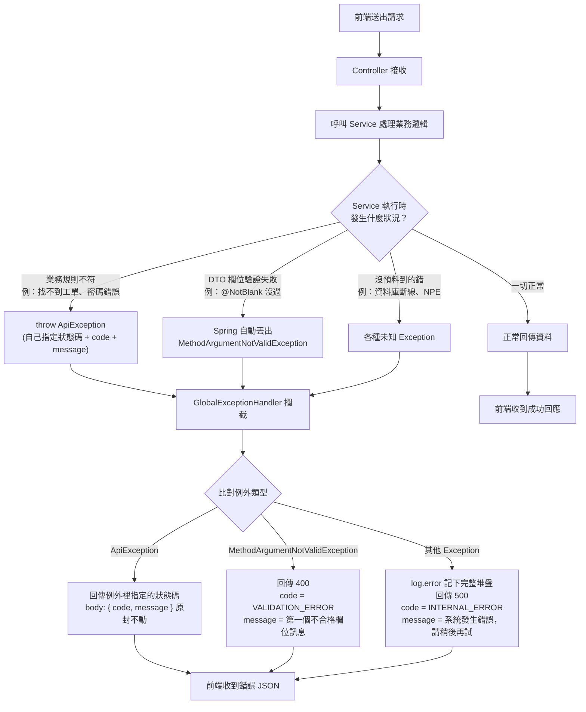

> 📌 本文件僅供個人參考閱讀，AI 寫 Code 時請勿參考此檔案內容。

# 錯誤自動處理流程

本專案的錯誤處理原則：**Controller 完全不寫 try-catch**，所有例外都交給
`GlobalExceptionHandler` 統一攔截，轉成固定格式的 JSON 回應給前端。

## 流程圖



## 重點說明

### 1. 為什麼 Controller 不用寫 try-catch？

`GlobalExceptionHandler` 加了 `@RestControllerAdvice`，Spring 會自動讓
**所有 Controller 丟出的例外**先經過這裡處理。如果沒有這一層，
Service 丟的 `ApiException` 會變成 Spring 預設的 500，
原本設計好的 401 / 404 語意就全部失效。

### 2. 三種例外，各自的處理方式

| 例外類型 | 誰丟的 | 什麼時候丟 | 回應內容 |
|---|---|---|---|
| `ApiException` | 我們自己（Service 層） | 業務規則不符，例如帳密錯誤、工單不存在 | 狀態碼、`code`、`message` 都由丟出的那一方決定，`GlobalExceptionHandler` 照搬 |
| `MethodArgumentNotValidException` | Spring 框架 | Controller 參數有加 `@Valid`，DTO 上 `@NotBlank` / `@Size` 等驗證沒過 | 固定 400，`code = VALIDATION_ERROR`，取第一個不合格欄位的訊息 |
| 其他 `Exception` | 未知（NPE、DB 斷線…） | 沒被上面兩種接住的所有例外 | 固定 500，`code = INTERNAL_ERROR`，訊息固定「系統發生錯誤，請稍後再試」——**真正原因只寫進 log，不回給前端**，避免洩漏資料表名稱、SQL 片段等內部細節 |

### 3. `ApiException` 的四個工廠方法

Service 層丟例外時不會直接 `new ApiException(...)`，而是用可讀性較好的靜態方法：

```java
ApiException.badRequest(code, message)   // 400：參數格式錯誤、非法狀態轉換
ApiException.unauthorized(code, message) // 401：未登入或帳密錯誤
ApiException.forbidden(code, message)    // 403：已登入但無權限
ApiException.notFound(code, message)     // 404：資料不存在
```

例如：

```java
// AgentService.java
return ApiException.unauthorized("INVALID_CREDENTIALS", "客服代號或密碼錯誤");

// TicketService.java
throw ApiException.notFound("AGENT_NOT_FOUND", "找不到客服：" + assigneeId);
```

### 4. 統一的回應格式

不管哪種例外，前端收到的錯誤永遠長這樣（定義在 `dto/ErrorResponse.java`）：

```json
{ "code": "INVALID_CREDENTIALS", "message": "客服代號或密碼錯誤" }
```

- `code`：給程式判斷用（例如前端看到特定 code 就導回登入頁）
- `message`：給人看的中文訊息，可以直接顯示在畫面上
